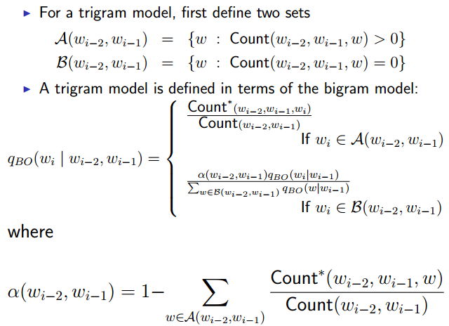

## Data Science Capstone Project
<br />
#### Project Description
<br />
Build a "Shiny" application on top of a prediction algorithm with an interface that accepts text as input and display the predicted words.
<br />
<br />
#### How to use the application
<br />
Type your text in Text Input box and click Submit and the application will suggest the next word. Five suggested words will appear in the text box below. The application only works with English language.

--- .class #id 

## The Prediction Algorithm (part I)

The prediction algorithm is based on a Trigram [Katz's back-off Model][1] which estimates the conditional probability of a word given the history in the 3-gram and 2-gram extracted from the corpus.




[1]:https://en.wikipedia.org/wiki/Katz%27s_back-off_model

--- .class #id 

## The Prediction Algorithm (part II)
<br />

In the Katz's back-off model the conditional probability of a word (wi) is discounted by the Good–Turing smoothing estimation.
<br />

Before using Katz's predicting algorithm the 3-gram and 2-gram have been extracted from the corpus and the [Good-Turing][1] discount calculated for the 3-gram and 2-gram.
<br />

The calculation of the Good-Turing discount factors were performed following the method in the reference publication.
[Gale William A. AT&T Bell Laboratories. Good-Turing Smoothing Without Tears. ][2]
(see sample code on the last slides)
<br />

When the algorithm doesn't find any match for the input text in the 3-gram or 2-gram, the output will display the five most frequent words (1-gram) in the corpus.


[1]:https://en.wikipedia.org/wiki/Good–Turing
[2]:http://www.d.umn.edu/~tpederse/Courses/CS8761-FALL02/Code/sgt-gale.pdf

--- .class #id 

## Obtaining the n-gram (part I)

#### Pre-processing the corpus previously to extracting the n-gram.
<br />
The characters that are not relevant for the words prediction are removed from the corpus, therefore the size of the n-gram will be smaller.

##### 1. Converting to lower case.
Key sensitive doesn't affect the word prediction despite the grammatical rules for capitalizing letter in words.
<br />
##### 2. Removing special characters and punctuation.
The dot "." as marker of the end of a phrase has been removed as well as  the dash "-" between words, however the single quote (') to include the most common short forms in English (e.g. I'm, he's,...)
<br />
##### 3. Removing numbers.
Numbers don't affect the word prediction.

--- .class #id 

## Obtaining the n-gram (part II)
<br />
#### Problem with the size of n-gram
The size of the n-gram obtain is of 5Gb for 3-gram and 2Gb for the 2-gram, too big for the memory of a normal mobile device as well as making the computing time too long.

#### Scaling the size of n-gram
By eliminating those n-gram with low frequency the error rate doesn't change significantly, [Seymore K. and Resenfeld R. 1996. Scalable Trigram Backoff Language Models.][3] 
<br />

Only the 3-gram and 2-gram that occur more than once are being considered, reducing the memory usage by ~85%.
<br />

As a result the size of the 3-gram was ~700Mb and that of the 2-gram was ~350Mb.

[3]:(https://www.cs.cmu.edu/~roni/papers/scalable-TR-96-139.pdf)


--- .class #id 

## Sample Code - Discount Factors I


```r
######
#Good-Turing smoothing functions
######

nrzest<-function(r, nr)
{
        d <- c(1, diff(r))
        dr <- c(0.5 * (d[-1] + d[ - length(d)]), d[length(d)])
        return(nr/dr)
}

rstest<-function(r, coef)
{
        return(r * (1 + 1/r)^(1 + coef[2]))
}
```


--- .class #id 
## Sample Code - Discount Factors II


```r
gt_discount<-function(df){
        w<-data.frame(table(df$freq))
        r<-as.numeric(levels(w$Var1))
        Nr<-as.numeric(w$Freq)
        
        N<-sum(r*Nr)
        
        #make averaging transform
        Zr<-nrzest(r,Nr)
        
        #get Linear Good-Turing estimate
        
        fit<-lm(log(Zr)~log(r))
        
        coef<-fit$coef
        r_gt<-rstest(r,coef)
        d<-r_gt/r
```

--- .class #id 
## Sample Code - Discount Factors III


```r
        #get Turing estimate
        j<-r==c(r[-1]-1,0)
        d_GT<-d_T<-rep(0,length(r))
        
        d_T[j]<-(r[j]+1)/r[j]*c(Nr[-1],0)[j]/Nr[j]
        
        #Good-Turing discount factor
        #make switch from Turing to LGT estimates
        tursd<-rep(1,length(r))
        for(i in 1:length(r))if(j[i])
                tursd[i]<-(i+1)/Nr[i]*sqrt(Nr[i+1]*(1+Nr[i+1]/Nr[i]))
        useturing<-TRUE
        for(i in 1:length(r)){
                if(!useturing) d_GT[i]<-d[i]
                else if(abs(d-d_T)[i]*i/tursd[i] > 1.65)
                        d_GT[i]<-d_T[i]
                else {useturing<-FALSE; d_GT[i]<-d[i]}
        }
                
#         d_GT[1:5]<-d_T[1:5]
#         d_GT[6:length(r)]<-d[6:length(r)]
        
        #renormalize the probabilities for observed objects
        sumpraw<-sum(d_GT*r*Nr/N)
        d_GT<-d_GT*(1-Nr[1]/N)/sumpraw
        
        return(data.frame(r,d_GT))
        
}
```


